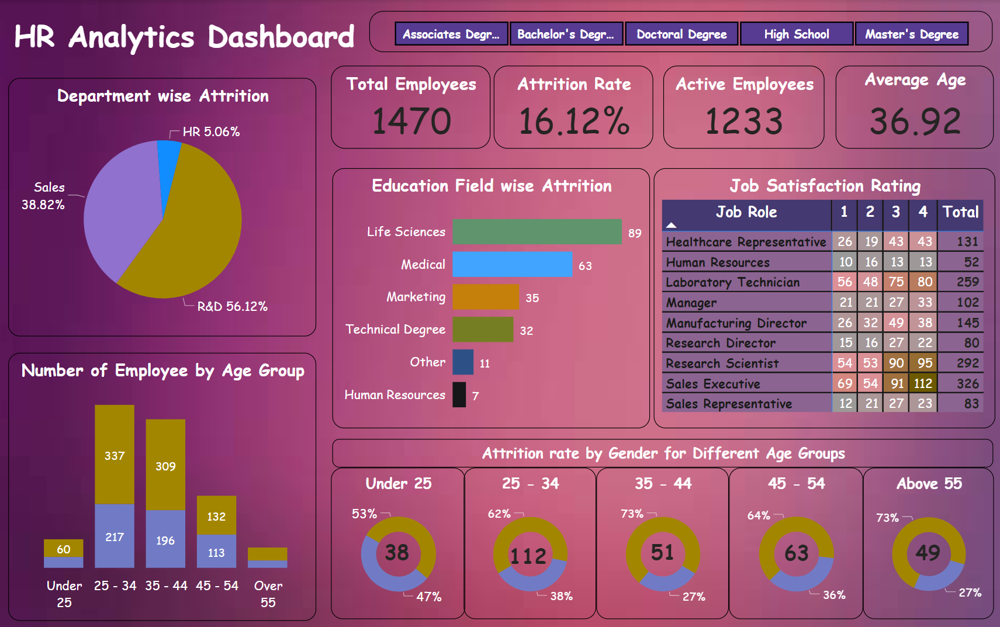

## **HR Analytics Dashboard: Empowering Workforce Management Through Data-Driven Insights** 🚀

---

### **Industry Context** 🌐
In today’s competitive business environment, effective workforce management is crucial for organizational success. The HR Analytics Dashboard serves as a powerful tool for Human Resources departments to monitor, analyze, and optimize employee-related metrics, thereby enabling better decision-making in workforce planning, retention strategies, and employee satisfaction.

---

### **Objective** 🎯
The primary objective of this dashboard is to provide comprehensive insights into key HR metrics such as employee attrition, job satisfaction, age distribution, and education fields. These insights are intended to help HR professionals and company leadership make informed decisions to improve employee retention, enhance job satisfaction, and optimize workforce distribution across departments.

---

### **About the Data** 📊
The dataset used in this dashboard includes detailed information on 1,470 employees across various departments. Key attributes in the dataset include:

- **Total Employees** 👥
- **Attrition Rate** 📉
- **Active Employees** 💼
- **Average Age** 🎂
- **Departments** 🏢
- **Job Roles** 🔧
- **Education Fields** 🎓
- **Job Satisfaction Ratings** 😊
- **Gender** ⚥
- **Age Groups** 📅

---

### **Data Preprocessing** 🛠️
Before conducting the analysis, several preprocessing steps were taken to ensure data quality and consistency:

- **Data Cleaning:** Missing values were handled, duplicates removed, and data types corrected for consistency.
- **Calculated Columns and Measures:** Age groups, tenure, attrition rates, and job satisfaction metrics were created.
- **Filtering and Aggregation:** Data was filtered by department and aggregated to analyze attrition, job satisfaction, and age distribution.
- **Data Modeling:** Relationships between tables were established, and hierarchies were defined for drill-down analysis.
- **Data Validation:** Integrity checks ensured the accuracy and consistency of all transformations and calculations.

---

### **Insights & Actionable Outcomes** 💡

- The company has **1,470** total employees, with an active workforce of **1,233** and an **attrition** rate of **16.12%**, indicating a moderate turnover. The average age of 36.92 years reflects a mature, mid-career workforce, crucial for planning retention and development strategies.

#### **Attrition Analysis** 📉

- **Department-wise Attrition:**
  - **R&D** had the highest attrition rate at **56.12%**, while **HR** had the lowest at **5.06%**.
  - **Sales** had a significant attrition rate of **38.82%**, indicating potential issues in employee retention within the department.

- **Gender-based Attrition:**
  - Attrition rates varied by gender across different age groups, with higher male attrition in the **25-34** age group (62% male vs. 38% female).

---

#### **Job Satisfaction** 😊

- **Satisfaction Ratings by Job Role:**
  - **Research Scientists** and **Sales Executives** had higher job satisfaction ratings, suggesting better alignment of job roles with employee expectations.
  - **Laboratory Technicians** displayed varied satisfaction levels, indicating potential areas for improvement.

---

#### **Employee Distribution** 🧑‍🤝‍🧑

- **Age Group Distribution:**
  - The largest proportion of employees fell within the **25-34** age group, followed by those aged **35-44**. This indicates a relatively young workforce, with a small proportion of employees aged over 55.

- **Education Field Attrition:**
  - Employees with **Life Sciences** and **Medical** degrees showed higher attrition rates, suggesting that these fields may require targeted retention strategies.

---

#### **Use Cases** 🛠️
- **HR Professionals** can use this dashboard to identify departments or roles with high attrition, enabling them to develop targeted retention strategies.
- **Executives** can leverage insights into job satisfaction and employee distribution to optimize workforce planning and ensure a balanced, satisfied team.

--- 
